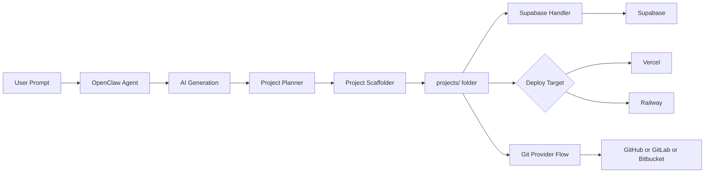

# Shipstack

**Build software with AI. Deploy it anywhere.**

<p align="center">
  <a href="LICENSE"></a>
  <a href="https://www.npmjs.com/package/shipstack"></a>
</p>

## What is Shipstack?

**Shipstack** is an AI-assisted software shipping tool built on top of [OpenClaw](https://github.com/openclaw/openclaw). It turns natural-language prompts into fully deployed projects.

Describe what you want to build in plain English — Shipstack generates the code, scaffolds the project, and deploys it to the platform of your choice: **Vercel**, **Supabase**, **Railway**, or your own hardware.

OpenClaw provides the AI agent foundation (gateway, agent orchestration, skill system), and Shipstack extends it with deployment automation and project generation workflows.

## Features

- **AI-Powered Generation** — Describe your project in a prompt; Shipstack plans and scaffolds static sites or full-stack apps with OpenAI-backed blueprints and deterministic fallbacks
- **Multi-Platform Deployment** — Prepare or deploy generated projects to Vercel, Railway, and Supabase-backed environments
- **Bot Interface** — Interact via Telegram to trigger builds and receive live URLs
- **Smart Scaffolding** — Generates full project structures including frontend assets, Node backends, Dockerfiles, SQL migrations, and deployment metadata
- **Project Management** — Each build gets a unique project folder under `projects/`
- **Git Provider Integration** — Connect GitHub, GitLab, or Bitbucket, list accessible repositories, and apply generated changes to a selected branch
- **Docker and Railway Ready** — One-click cloud deployment for the Shipstack bot itself

## Installation

### Option 1: npm (recommended)

```bash
npm install -g shipstack
shipstack init
```

### Option 2: From source

```bash
# Clone the repository
git clone https://github.com/YOUR_USERNAME/shipstack.git
cd shipstack

# Install Node.js dependencies
pnpm install

# Set up Python virtual environment
python3 -m venv .venv
# Linux / macOS:
source .venv/bin/activate
# Windows:
# .venv\Scripts\activate

pip install -r requirements.txt

# Configure environment variables
cp .env.example .env
# Edit .env with your API keys (see Environment Variables below)
```

### Prerequisites

- **Node.js** >= 22
- **Python** >= 3.10
- **pnpm** (recommended) or npm
- **Vercel CLI** — `npm install -g vercel` for Vercel deploys
- **Railway CLI** — optional, for Railway deploys
- An **OpenAI API key**
- A **Vercel API token** for Vercel deployment

## Environment Variables

Create a `.env` file in the project root (or copy `.env.example`):

```env
# Required — OpenAI API key for AI content generation
# Get one at: https://platform.openai.com/api-keys
OPENAI_API_KEY=sk-your-openai-api-key

# Optional — Vercel token for deployment
# Get one at: https://vercel.com/account/tokens
VERCEL_TOKEN=your-vercel-token

# Optional — Vercel team scope (if deploying under a team)
VERCEL_SCOPE=your-vercel-team

# Optional — Railway token for deployment
RAILWAY_TOKEN=your-railway-token

# Optional — Supabase project wiring
SUPABASE_URL=https://your-project.supabase.co
SUPABASE_ANON_KEY=your-supabase-anon-key
SUPABASE_SERVICE_ROLE_KEY=your-supabase-service-role-key
SUPABASE_PROJECT_REF=your-supabase-project-ref

# Optional — Git provider tokens
GITHUB_TOKEN=ghp_your-token
GITLAB_TOKEN=glpat-your-token
BITBUCKET_USERNAME=your-bitbucket-username
BITBUCKET_APP_PASSWORD=your-bitbucket-app-password
BITBUCKET_WORKSPACE=your-bitbucket-workspace

# Optional — Telegram bot token (for bot interface)
# Create a bot via @BotFather on Telegram
TELEGRAM_BOT_TOKEN=your-telegram-bot-token
```

## Usage

### CLI

Generate and deploy a project directly from the command line:

```bash
# Static site
python skills/website_builder/handler.py "Build a portfolio site for a photographer named Alex"

# Full-stack app prepared for Railway and Supabase
python skills/website_builder/handler.py "Build a customer portal with login, database, and Railway deployment"
```

Example output:

```
✅ Project created successfully!
📁 Local path: projects/alex-photography-a1b2c3d4/
🧩 Project type: static_site
🚀 Deploy target: vercel
🌍 Live URL: https://alex-photography-a1b2c3d4.vercel.app
```

### Bot Interface

Start the gateway to interact via Telegram:

```bash
# Build the project
pnpm build

# Start the gateway
pnpm start gateway --allow-unconfigured --port 18789
```

Then send a message to your Telegram bot:

> "Build me a landing page for a SaaS product called CloudSync that helps teams collaborate in real-time"

The bot generates the project and replies with the local path plus any deployment URL returned by the selected handler.

## Deployment Targets

| Platform            | Status    | Description                                                               |
| ------------------- | --------- | ------------------------------------------------------------------------- |
| **Vercel**          | Supported | Static sites deployed via Vercel CLI                                      |
| **Supabase**        | Supported | Auth/data integration, env wiring, and SQL migrations for full-stack apps |
| **Railway**         | Supported | Full-stack app deployment preparation and CLI deploy flow                 |
| **Custom Hardware** | Planned   | Deploy to your own servers via SSH/Docker                                 |

## Deploy Shipstack Itself to Railway

You can self-host the Shipstack bot on Railway:

1. Push this repo to GitHub
2. Connect it to [Railway](https://railway.app)
3. Set your environment variables in Railway's dashboard (`OPENAI_API_KEY`, `VERCEL_TOKEN`, `TELEGRAM_BOT_TOKEN`)
4. Railway uses `railway.json` and `Dockerfile` to build and deploy automatically

The boot script (`scripts/railway-setup.sh`) configures the gateway, sets up the Python environment, and starts the Telegram bot.

## Architecture Overview

```
shipstack/
├── src/                         # Core TypeScript gateway and agent system (OpenClaw)
│   ├── gateway/                 # HTTP gateway server
│   ├── agents/                  # AI agent orchestration
│   ├── cli/                     # CLI commands
│   └── config/                  # Configuration management
│
├── skills/                      # Pluggable AI skills
│   └── website_builder/         # Project generation + deploy/git pipeline
│       ├── handler.py           # Main skill entrypoint
│       ├── wb_pipeline.py       # Planner → scaffold → deploy → git flow
│       ├── wb_scaffold.py       # Static and full-stack scaffold writers
│       ├── wb_deploy.py         # Vercel, Railway, and Supabase handlers
│       ├── wb_git.py            # GitHub, GitLab, and Bitbucket integrations
│       ├── SKILL.md             # Skill documentation and triggers
│       ├── skill.yaml           # Skill metadata
│       └── templates/           # Base templates and assets
│
├── scripts/                     # Deployment and setup scripts
│   └── railway-setup.sh         # Railway boot script
│
├── projects/                    # Generated project output (gitignored)
├── Dockerfile                   # Container build
├── docker-compose.yml           # Local Docker development
└── railway.json                 # Railway deployment config
```

### How It Works



1. **User sends a prompt** — via CLI or Telegram bot
2. **OpenClaw agent** receives the prompt and routes it to the appropriate skill
3. **AI or fallback planner** builds a project blueprint — app type, routes, entities, features, and deployment target
4. **Scaffolder creates files** — static assets or a full-stack Node project with deploy metadata
5. **Integration handlers** generate Supabase config and SQL migrations when requested
6. **Deployment handlers** deploy or prepare the project for Vercel, Railway, or local use
7. **Git adapters** can list repos, clone a chosen repo, apply changes, and push them to a branch

## Built on OpenClaw

Shipstack is built on top of [OpenClaw](https://github.com/openclaw/openclaw), an open-source personal AI assistant. Shipstack uses:

- **Gateway** — OpenClaw's HTTP gateway for routing messages and managing the bot lifecycle
- **Agent System** — AI agent orchestration that processes prompts and invokes skills
- **Skill Infrastructure** — the pluggable skill system (`SKILL.md` + `skill.yaml` + `handler.py`) that Shipstack extends with deployment-focused skills
- **Channel Integrations** — Telegram (and other channels) for the bot interface

## Roadmap

- [ ] Publish as npm package (`npm install -g shipstack`)
- [ ] `shipstack build "prompt"` CLI command
- [ ] More project types — React, Next.js, API backends
- [x] Supabase integration — full-stack apps with database and auth
- [x] Railway auto-deploy — backend services and APIs
- [x] Git provider repo updates for generated projects
- [ ] Custom domain support
- [ ] Interactive editing ("change the hero color to blue")
- [ ] Project templates library
- [ ] Deploy to custom hardware via SSH/Docker

## Contributing

Contributions are welcome!

1. Clone the repository
2. Create a feature branch (`git checkout -b feature/my-feature`)
3. Make your changes
4. Run tests: `pnpm test`
5. Submit a pull request

For larger changes, please open an issue first to discuss the approach.

## License

MIT License — see [LICENSE](LICENSE) for details.
